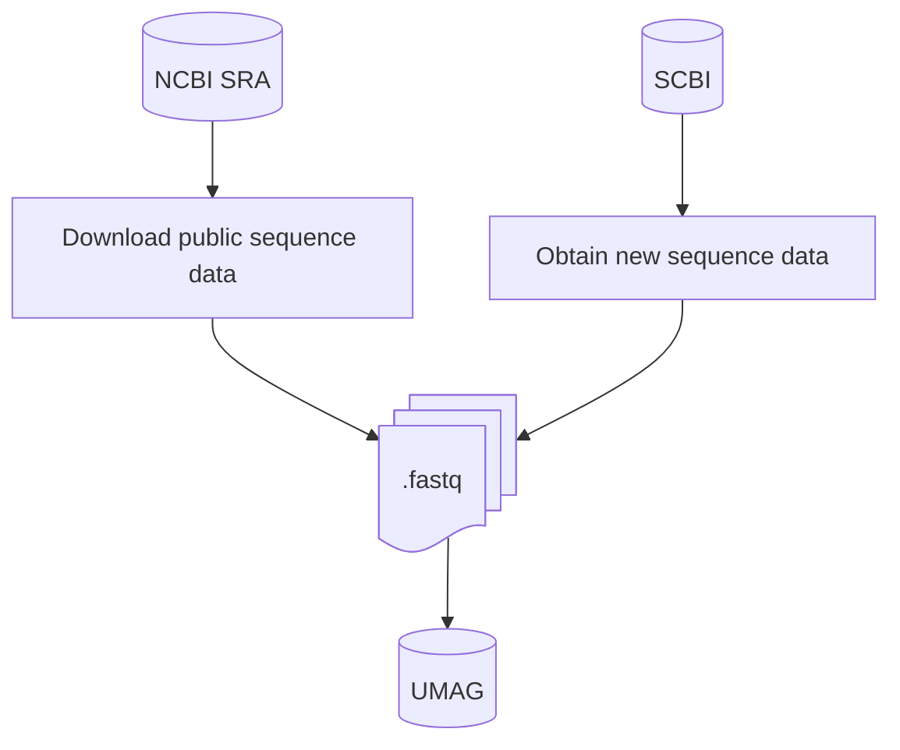

# Preparing short-read, Illumina WGS sequencing data prior to variant calling with GATK (v##)

```mermaid
flowchart TD
    A[(NCBI SRA)] --> B[Download public sequence data]
    C[(SCBI)] --> D[Obtain new sequence data]
    B & D --> E[.fastq]@{ shape: docs}
    E --> F[(UMAG)]
```
